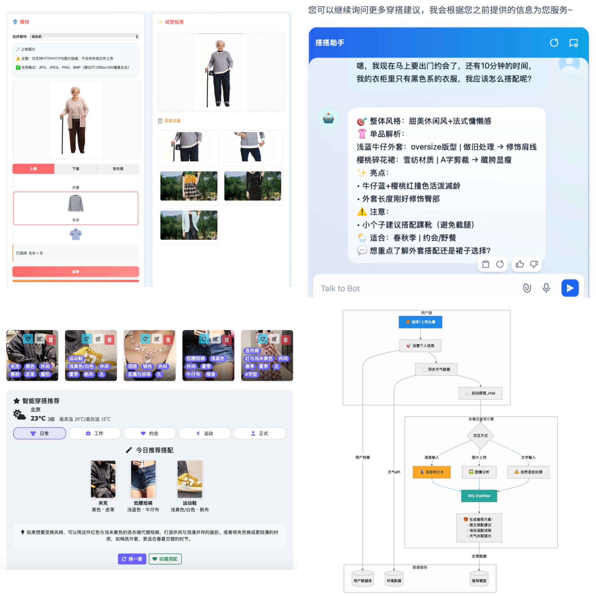

# FashionGenius · 衣智未来 👗✨

> **Your 24×7 AI stylist** 虚拟试穿、数字化衣橱与交互式穿搭推荐，为您提供智能的时尚搭配体验～

<p align="center">
  
</p>

---

## ✨  Core Highlights
| 功能 | 说明 |
|------|------|
| **虚拟试衣** | 调用 **OutfitAnyone** 条件扩散模型，生成高保真穿衣效果图 |
| **数字化衣橱** | AI 自动提取 _类型 / 颜色 / 风格 / 季节 / 材质_ 等属性，结构化保存 |
| **个性化 OOTD** | 汇总衣橱 + 天气 + 场合，由 **Dify** ChatFlow 即时生成搭配方案 |
| **多模态对话** | 文字 / 语音 / 图像输入皆可，实时获取时尚建议 |
| **低代码原型** | 基于 **Flask** + **Dify** + 前端纯 HTML/JS，5 天完成 MVP |

---

## 🏗  Architecture

```text
┌──────────┐     HTTP      ┌────────────┐
│ Frontend │──────────────▶│  Flask API │─────────┐
│ (Bootstrap│              │  Gateway   │         │
│  + JS)    │◀─────────────│            │         │
└──────────┘  WebSocket    └────┬───────┘         │
                                 │                │
                Dify ChatFlow    │ REST           │ OutfitAnyone
                (RAG Fusion)     ▼                ▼  Virtual Try‑On
                            ┌───────────┐    ┌──────────────┐
                            │  Dify     │    │  AliCloud    │
                            │ LLM / KB  │    │  API         │
                            └───────────┘    └──────────────┘
```
- Dify – RAG 框架，负责知识检索、多模态理解与搭配生成
- Flask – 轻量后端网关，整合 Dify / OutfitAnyone / Weather API
- OutfitAnyone – 条件扩散模型，实现零镜头虚拟试穿

## 🚀 Quick Start
```
# 1. Clone & install
git clone https://github.com/Frantzzzzz/FashionGenius.git
cd 代码
pip install -r requirements.txt

# 2. Set environment keys
cd ai试衣间
rm .env
echo "API_KEY=your-api-key" > .env   # 填写你的阿里云API_KEY

cd ..
cd 智能衣橱（+定位&天气api)
rm .env
echo "BAIDU_MAP_AK=your-api-key" > .env   # 填写你的百度地图API_KEY
echo "DEFAULT_IP=220.181.38.148" >> .env   # 默认用公网ip获取天气信息

# 3. Run development server
cd ..

# 3.1 智能衣橱
cd 智能衣橱（+定位&天气api)
python weather_dify.py   # 然后访问 http://localhost:8888

# 3.2 AI试衣间
cd ..
cd ai试衣间
python to.py   # 然后访问 http://localhost:5004

# 3.3 个性化穿搭推荐聊天助手
# 直接点击 chat.html 就可以尽情玩耍啦～

```

