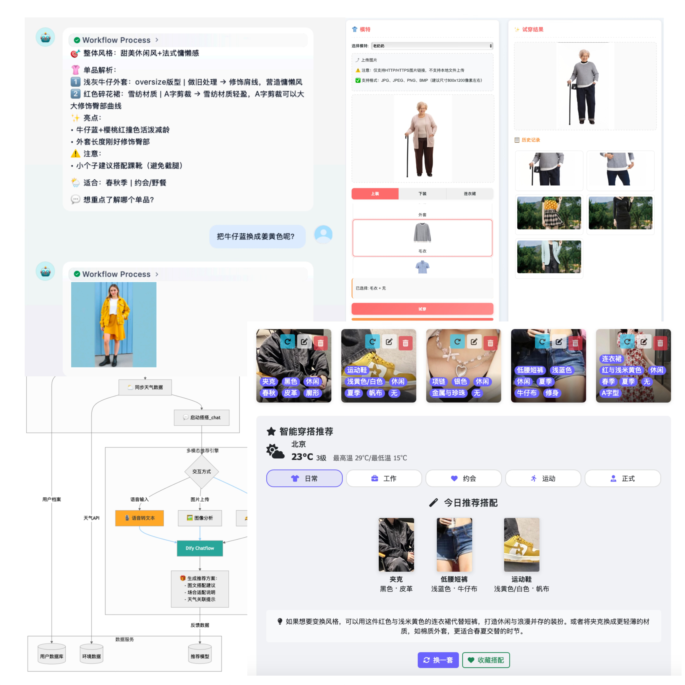

# FashionGenius · 衣智未来 👗✨

> 用技术重新定义时尚：虚拟试衣、智能搭配、数字衣橱，一键搞定 OOTD（今日穿搭）！

<p align="center">
  
</p>

---

> ⚠️ 技术宅警告：本项目可能包含以下危险内容：
> - 🤖 让选择困难症患者集体失业的 AI 穿搭系统
> - 🧙‍♂️ 把衣柜变成「时尚SQL数据库」的数字化魔法
> - 🧑‍💻 一不小心让你从码农变身时尚博主的恐怖力量

---

## ✨  Core Highlights
| 模块 | 说明 |
|------|------|
| **虚拟试衣** | 你的专属试衣间！轻松上传服装照片，选择合适的模特，**OutfitAnyone** 为你提供最真实的穿搭效果！|
| **数字化衣橱** | 你的衣橱管家！利用 MLLM 智能分析服饰特征，自动分类并存储，结合天气和场合需求，为你提供个性化穿搭建议！|
| **穿搭助手** | 你的AI穿搭专家！通过智能分析头像、风格偏好和体型数据，由 **Dify** ChatFlow 即时生成量身定制的穿搭建议，让时尚触手可及！|
| **多模态对话** | 你的全能时尚顾问！支持文字、语音、图像、视频输入，带你进入潮人领域！|
| **低代码原型** | 快速构建你的时尚平台！**Flask** + **Dify** + 前端纯 HTML/JS ，无需复杂编码，轻松实现OOTD自由！|

---

## 🏗  Architecture

```text
┌──────────┐     HTTP      ┌────────────┐
│ Frontend │──────────────▶│  Flask API │─────────┐
│ (Bootstrap│              │  Gateway   │         │
│  + JS)    │◀─────────────│            │         │
└──────────┘  WebSocket    └────┬───────┘         │
                                 │                │
                Dify ChatFlow    │ REST           │ OutfitAnyone
                (RAG Fusion)     ▼                ▼  Virtual Try‑On
                            ┌───────────┐    ┌──────────────┐
                            │  Dify     │    │  AliCloud    │
                            │ LLM / KB  │    │  API         │
                            └───────────┘    └──────────────┘
```
- Dify – RAG 框架，负责知识检索、多模态理解与搭配生成
- Flask – 轻量后端网关，整合 Dify / OutfitAnyone / Weather API
- OutfitAnyone – 阿里云发布的条件扩散模型，实现零镜头虚拟试穿

## 🚀 Quick Start
```
# 1. Clone & install
git clone https://github.com/Frantzzzzz/FashionGenius.git
cd 代码
pip install -r requirements.txt

# 2. Set environment keys
cd ai试衣间
rm .env
echo "API_KEY=your-api-key" > .env   # 填写你的阿里云API_KEY

cd ..
cd 智能衣橱（+定位&天气api)
rm .env
echo "BAIDU_MAP_AK=your-api-key" > .env   # 填写你的百度地图API_KEY
echo "DEFAULT_IP=220.181.38.148" >> .env   # 默认用公网ip获取天气信息

# 3. Run development server
cd ..

# 3.1 智能衣橱
cd 智能衣橱（+定位&天气api)
python weather_dify.py   # 然后访问 http://localhost:8888

# 3.2 AI试衣间
cd ..
cd ai试衣间
python to.py   # 然后访问 http://localhost:5004

# 3.3 个性化穿搭推荐聊天助手
# 直接点击 chat.html 就可以尽情玩耍啦～

```

